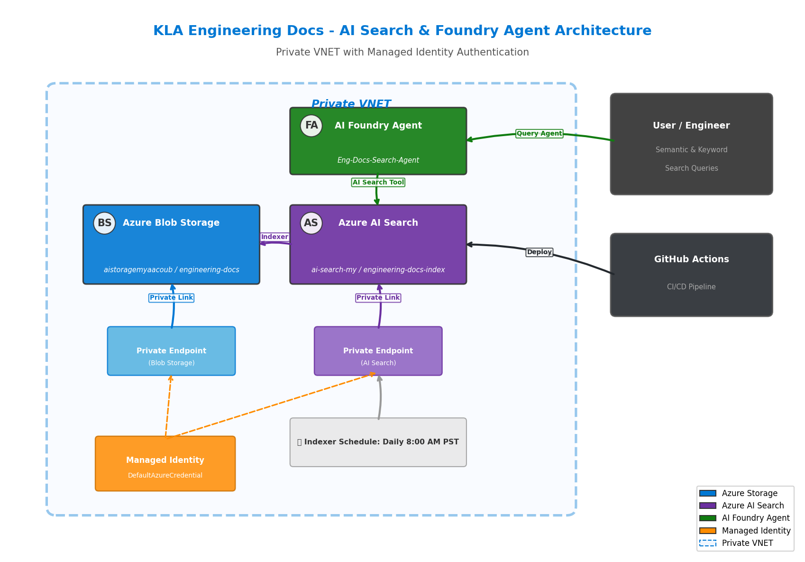

# KLA Engineering Docs - AI Search & Foundry Agent

An end-to-end solution that indexes 100 KLA manufacturing engineering test case documents in Azure Blob Storage, creates an Azure AI Search index with semantic and keyword search, and exposes a Foundry Agent that answers questions exclusively from the indexed documents.

## Architecture



**Components:**

| Component | Resource | Description |
|-----------|----------|-------------|
| **Azure Blob Storage** | configured via `AZURE_STORAGE_ACCOUNT_NAME` | Stores engineering test case documents in the blob container |
| **Private VNET & Endpoints** | Existing VNET | Blob Storage accessed via private endpoint for secure data transfer |
| **Azure AI Search** | configured via `AZURE_SEARCH_SERVICE_NAME` | Indexes documents with semantic + keyword search; refreshes daily at 8 AM PST |
| **AI Foundry Agent** | configured via `AGENT_NAME` | Answers engineering queries using only the AI Search index — no web search or fabrication |
| **Managed Identity** | `DefaultAzureCredential` | All authentication uses managed identity — no keys or secrets |

---

## Prerequisites

- **Azure CLI** installed and logged in (`az login`)
- **Python 3.10+** installed
- Azure subscription with the following resources already provisioned:

  | Resource | Description |
  |----------|-------------|
  | **Resource Group** | A resource group to contain all resources below |
  | **Storage Account** | General-purpose v2 storage account (recommended: private VNET + private endpoint for production) |
  | **Blob Container** | Container inside the storage account for engineering documents (default name: `engineering-docs`) |
  | **Azure AI Search service** | Standard tier or higher (required for semantic search) |
  | **Azure AI Foundry Hub + Project** | An AI Foundry hub with a project; register the AI Search service as a connected resource inside the project |
  | **Model deployment** | A chat-completion model deployed inside the Foundry project (e.g., `gpt-4.1`) |

---

## Setup Commands

### 1. Clone and install dependencies

```bash
git clone <repository-url>
cd AI-Search-Blob-Storage
pip install -r requirements.txt
```

### 2. Configure resource names

All Azure resource names and configuration values are managed through environment
variables. A template file lists every available option:

```bash
cp .env.example .env
```

Open `.env` and fill in the values for your deployment:

| Variable | Required | Description |
|----------|:--------:|-------------|
| `AZURE_SUBSCRIPTION_ID` | ✅ | Azure subscription ID |
| `AZURE_RESOURCE_GROUP` | ✅ | Resource group containing all resources |
| `AZURE_STORAGE_ACCOUNT_NAME` | ✅ | Storage Account name |
| `AZURE_SEARCH_SERVICE_NAME` | ✅ | AI Search service name |
| `AZURE_AI_PROJECT_ENDPOINT` | ✅ | Foundry project endpoint URL (`https://<hub>.services.ai.azure.com/api/projects/<project>`) |
| `AZURE_AI_SEARCH_CONNECTION_NAME` | ✅ | Name of the AI Search connection registered in the Foundry project |
| `MODEL_DEPLOYMENT_NAME` | ✅ | Deployed model name (e.g. `gpt-4.1`) |
| `AZURE_STORAGE_CONTAINER_NAME` | ➖ | Blob container name (default: `engineering-docs`) |
| `AZURE_SEARCH_INDEX_NAME` | ➖ | Search index name (default: `engineering-docs-index`) |
| `AZURE_SEARCH_CHUNKED_INDEX_NAME` | ➖ | Chunked index name (default: `engineering-docs-chunked-index`) |
| `AZURE_SEARCH_INDEXER_NAME` | ➖ | Indexer name (default: `engineering-docs-indexer`) |
| `AZURE_SEARCH_DATA_SOURCE_NAME` | ➖ | Data source name (default: `engineering-docs-blob-datasource`) |
| `AGENT_NAME` | ➖ | Foundry agent display name (default: `Eng-Docs-Search-Agent`) |
| `FINE_TUNE_BASE_MODEL` | ➖ | Base model for fine-tuning (default: `gpt-4.1`) |

> **Note:** The `.env` file is git-ignored so your values are never committed.
> In CI/CD (GitHub Actions) set these as repository secrets / environment variables instead.

### 3. Authenticate with Azure

```bash
# Login with your Azure account
az login

# Set the subscription (use your AZURE_SUBSCRIPTION_ID value)
az account set --subscription "<AZURE_SUBSCRIPTION_ID>"
```

### 4. Assign managed identity roles

```bash
# Get your signed-in user object ID
USER_OBJECT_ID=$(az ad signed-in-user show --query id -o tsv)

# Set convenience variables matching your .env values
SUBSCRIPTION_ID="<AZURE_SUBSCRIPTION_ID>"
RESOURCE_GROUP="<AZURE_RESOURCE_GROUP>"
STORAGE_ACCOUNT="<AZURE_STORAGE_ACCOUNT_NAME>"
SEARCH_SERVICE="<AZURE_SEARCH_SERVICE_NAME>"

# Storage Blob Data Contributor on the storage account
az role assignment create \
  --assignee "$USER_OBJECT_ID" \
  --role "Storage Blob Data Contributor" \
  --scope "/subscriptions/$SUBSCRIPTION_ID/resourceGroups/$RESOURCE_GROUP/providers/Microsoft.Storage/storageAccounts/$STORAGE_ACCOUNT"

# Search Index Data Contributor on the search service
az role assignment create \
  --assignee "$USER_OBJECT_ID" \
  --role "Search Index Data Contributor" \
  --scope "/subscriptions/$SUBSCRIPTION_ID/resourceGroups/$RESOURCE_GROUP/providers/Microsoft.Search/searchServices/$SEARCH_SERVICE"

# Search Service Contributor on the search service
az role assignment create \
  --assignee "$USER_OBJECT_ID" \
  --role "Search Service Contributor" \
  --scope "/subscriptions/$SUBSCRIPTION_ID/resourceGroups/$RESOURCE_GROUP/providers/Microsoft.Search/searchServices/$SEARCH_SERVICE"

# Azure AI Developer on the resource group
az role assignment create \
  --assignee "$USER_OBJECT_ID" \
  --role "Azure AI Developer" \
  --scope "/subscriptions/$SUBSCRIPTION_ID/resourceGroups/$RESOURCE_GROUP"

# Allow AI Search managed identity to read from Blob Storage
SEARCH_MI=$(az search service show \
  --name "$SEARCH_SERVICE" \
  --resource-group "$RESOURCE_GROUP" \
  --query identity.principalId -o tsv)

az role assignment create \
  --assignee "$SEARCH_MI" \
  --role "Storage Blob Data Reader" \
  --scope "/subscriptions/$SUBSCRIPTION_ID/resourceGroups/$RESOURCE_GROUP/providers/Microsoft.Storage/storageAccounts/$STORAGE_ACCOUNT"
```

### 5. Generate engineering documents

```bash
python scripts/generate_docs.py
```

### 5. Upload documents to Blob Storage

```bash
python scripts/upload_to_blob.py
```

### 6. Create AI Search index and indexer

```bash
python scripts/create_search_index.py
```

### 6b. (Enhanced) Chunk documents by section and index

```bash
python scripts/chunk_and_index.py
```

This creates an optimized `engineering-docs-chunked-index` with section-level chunking, metadata facets, and custom scoring. See [AI Search Best Practices](#ai-search-best-practices) below.

### 7. Create Foundry agent

```bash
python scripts/create_agent.py
```

### 8. Fine-tune and evaluate model

```bash
python scripts/fine_tune_and_evaluate.py
```

This generates training data from the engineering docs, fine-tunes the model, evaluates accuracy, and produces [docs/evaluation_results.md](docs/evaluation_results.md). See [Fine-Tuning & Evaluation](#fine-tuning--evaluation) below.

### 9. Generate architecture diagram

```bash
python scripts/generate_architecture_diagram.py
```

### 10. Run tests

```bash
python scripts/test_search.py
```

---

## Sample Search Prompts

### Semantic Search (Natural Language)

These queries use AI-powered semantic understanding to find relevant documents:

| # | Prompt | Expected Results |
|---|--------|-----------------|
| 1 | *"What are the most common defect types found during wafer inspection?"* | Documents covering various defect types like COP, scratches, haze, contamination |
| 2 | *"Which test cases failed and what corrective actions were recommended?"* | Test cases with FAIL status and their Section 8 corrective actions |
| 3 | *"How does the Surfscan system detect crystal originated particles?"* | Surfscan SP7/SP5 test cases for COP/particle detection |
| 4 | *"What is the acceptance criteria for 5nm node patterned wafer inspection?"* | Test cases at the 5nm technology node with acceptance criteria details |
| 5 | *"Show me test results for post-CMP contamination inspection"* | Post-CMP process step documents covering contamination defects |
| 6 | *"What inspection systems are used for FinFET manufacturing?"* | FinFET-related test cases across different KLA product lines |
| 7 | *"Find documents about overlay metrology using the Archer system"* | Archer 700/750 overlay measurement test cases |
| 8 | *"What are the throughput requirements for 300mm wafer inspection?"* | 300mm wafer test cases with throughput acceptance criteria |

### Keyword Search (Exact Match)

These queries use traditional keyword matching:

| # | Prompt | Expected Results |
|---|--------|-----------------|
| 1 | *"Surfscan SP7 particle detection"* | Documents mentioning Surfscan SP7 and particle detection |
| 2 | *"FinFET inspection post-etch defect"* | FinFET test cases at the post-etch process step |
| 3 | *"3nm technology node scratch detection"* | 3nm node documents covering scratch defects |
| 4 | *"CMP process wafer inspection FAIL"* | Failed test cases from CMP process steps |
| 5 | *"overlay metrology Archer 700"* | Archer 700 overlay measurement documents |
| 6 | *"KLA-MFG-TC-0042"* | Specific test case document by number |
| 7 | *"Milpitas Fab A calibration"* | Documents from Milpitas Fab A |
| 8 | *"nuisance rate corrective action"* | Documents discussing nuisance rate issues and fixes |

---

## GitHub Actions Deployment

The repository includes a GitHub Actions workflow (`.github/workflows/deploy.yml`) that automates the full deployment:

1. Generates engineering documents
2. Uploads to Blob Storage
3. Creates the AI Search index and indexer
4. Creates the Foundry agent
5. Runs search tests to validate

### Required GitHub Secrets

| Secret | Description |
|--------|-------------|
| `AZURE_CLIENT_ID` | Service principal or managed identity client ID |
| `AZURE_TENANT_ID` | Azure AD tenant ID |
| `AZURE_AI_SEARCH_CONNECTION_NAME` | AI Search connection name in Foundry project |
| `MODEL_DEPLOYMENT_NAME` | Model deployment name (default: `gpt-4o`) |

---

## AI Search Best Practices

This project implements the following best practices for Azure AI Search to maximize result accuracy and relevance.

### 1. Section-Level Chunking

**Problem:** Indexing full documents as single records dilutes search relevance — a query about "acceptance criteria" matches a 5KB document even though only 200 characters are relevant.

**Solution:** The `chunk_and_index.py` script splits each engineering document into section-level chunks:

| Section | Purpose | Typical Size |
|---------|---------|-------------|
| Document Header | Metadata, author, dates, classification | ~500 chars |
| 1. OBJECTIVE | What the test validates | ~400 chars |
| 2. SCOPE | Equipment, defect type, fab location | ~300 chars |
| 3. TEST CONFIGURATION | System settings, recipe, scan parameters | ~400 chars |
| 4. TEST PROCEDURE | Step-by-step instructions | ~800 chars |
| 5. ACCEPTANCE CRITERIA | Pass/fail thresholds | ~500 chars |
| 6. TEST RESULTS | Defect counts, capture rate, nuisance rate | ~400 chars |
| 7. OBSERVATIONS | Findings and notes | ~500 chars |
| 8. CORRECTIVE ACTIONS | Recommended fixes | ~300 chars |
| 9. SIGN-OFF | Approvals | ~200 chars |

Each chunk retains a context prefix (`Document: KLA-MFG-TC-XXXX | Title\nSection: ...`) so the search engine understands provenance even for standalone chunks.

### 2. Metadata-Enriched Fields

Every chunk includes structured filterable/facetable metadata:

```
document_number, title, status, product_line, target_defect,
process_step, technology_node, fab_location, section_name, source_file
```

This enables **faceted navigation** (e.g., "show all FAIL results for 5nm node") and **filtered search** (e.g., `$filter=technology_node eq '3nm'`).

### 3. Custom Scoring Profile

A `boost-title-section` scoring profile weights fields by relevance:

| Field | Weight | Rationale |
|-------|--------|-----------|
| `title` | 3.0× | Most descriptive of document content |
| `document_number` | 2.5× | Exact lookup by doc ID should rank highest |
| `section_name` | 2.0× | Users often search for specific sections |
| `content` | 1.0× | Baseline full-text search |

### 4. Semantic Configuration with Keywords

The semantic config includes `keywords_fields` for `document_number` and `section_name`, improving the semantic ranker's ability to prioritize results when users mention specific doc IDs or section names.

### 5. Overlap for Large Sections

When a section exceeds `MAX_CHUNK_SIZE` (2000 chars), it's split into sub-chunks with 200-character overlap at line boundaries. This prevents information loss at chunk boundaries.

### 6. English Microsoft Analyzer

All searchable text fields use the `en.microsoft` analyzer, which provides:
- Lemmatization (e.g., "inspecting" → "inspect")
- Compound word splitting
- Better handling of technical vocabulary than the default Lucene analyzer

### 7. Idempotent Operations

All index, data source, and indexer creation uses `create_or_update_*` methods, making the pipeline safe to re-run without manual cleanup.

### 8. Batch Upload with BufferedSender

`SearchIndexingBufferedSender` handles automatic batching, retries, and throttling when uploading chunks — critical for reliable indexing of 700+ chunks.

### 9. Daily Scheduled Refresh

The indexer runs at 8:00 AM PST (16:00 UTC) daily, ensuring new or updated documents in Blob Storage are automatically reflected in search results.

### 10. Managed Identity Authentication

All connections (Blob Storage data source, Search API, Foundry) use `DefaultAzureCredential` / managed identity — no connection strings or keys stored in code.

---

## Fine-Tuning & Evaluation

The project includes a pipeline to fine-tune a model on the KLA engineering documents and evaluate its accuracy. If fine-tuning is not available in the Foundry project's region, the script gracefully falls back to evaluating the deployed base model.

### How It Works

1. **Training Data Generation**: Q&A pairs are automatically extracted from all 100 documents. Each document yields 5-7 pairs covering objectives, results, systems, acceptance criteria, observations, and corrective actions.

2. **Fine-Tuning**: The training data (JSONL format) is uploaded to Azure AI Foundry, and a fine-tuning job is created on the base model (default: `gpt-4.1`). If fine-tuning is unavailable in the region, the script skips this step and proceeds to evaluation.

3. **Evaluation**: The fine-tuned (or base) model is evaluated on a held-out 20% validation set. Key metrics:
   - **Citation Accuracy**: Does the model correctly cite KLA-MFG-TC document numbers?
   - **Response Relevance**: Does the response contain expected information?
   - **Token Efficiency**: Cost per query

### Running Fine-Tuning

```bash
# Use default base model (gpt-4.1)
python scripts/fine_tune_and_evaluate.py

# Or specify a different base model
export FINE_TUNE_BASE_MODEL="gpt-4.1"
python scripts/fine_tune_and_evaluate.py
```

### Latest Evaluation Results (April 2026)

| Metric | Value |
|--------|-------|
| **Model Evaluated** | `gpt-4.1` |
| **Training Examples** | 539 |
| **Validation Examples** | 135 |
| **Evaluated Samples** | 50 |
| **Citation Accuracy** | **90.0%** |
| **Avg Tokens/Query** | 222.8 |

> **Note**: Fine-tuning is not currently available in the `westus` region. The evaluation above reflects the base `gpt-4.1` model's performance on the KLA engineering Q&A dataset. When fine-tuning becomes available, re-run the script to compare fine-tuned vs. base model accuracy.

See [docs/evaluation_results.md](docs/evaluation_results.md) for the full report including:
- Per-example citation match results
- Sample predictions with expected vs. actual answers
- Recommendations for improvement

### Generated Files

| File | Description |
|------|-------------|
| `data/fine_tuning_train.jsonl` | Training dataset (~80% of Q&A pairs) |
| `data/fine_tuning_validation.jsonl` | Validation dataset (~20% of Q&A pairs) |
| `data/evaluation_metrics.json` | Raw evaluation metrics (JSON) |
| `docs/evaluation_results.md` | Human-readable evaluation report |

---

## Project Structure

```
AI-Search-Blob-Storage/
├── .github/
│   └── workflows/
│       └── deploy.yml              # GitHub Actions CI/CD pipeline
├── data/                           # Generated engineering documents (100 files)
│   ├── KLA-MFG-TC-0001.txt
│   ├── ...
│   ├── KLA-MFG-TC-0100.txt
│   ├── manifest.json
│   ├── fine_tuning_train.jsonl     # Training data for fine-tuning
│   ├── fine_tuning_validation.jsonl # Validation data for evaluation
│   └── evaluation_metrics.json     # Raw evaluation metrics
├── docs/
│   ├── architecture.png            # Architecture diagram
│   ├── evaluation_results.md       # Fine-tuning evaluation report
│   └── Prompt.txt                  # Original project requirements
├── scripts/
│   ├── config.py                   # Centralised configuration (reads from env / .env)
│   ├── generate_docs.py            # Generate 100 KLA test case documents
│   ├── upload_to_blob.py           # Upload docs to Blob Storage
│   ├── create_search_index.py      # Create AI Search index + indexer
│   ├── chunk_and_index.py          # Section-level chunking + enhanced index
│   ├── create_agent.py             # Create Foundry agent
│   ├── fine_tune_and_evaluate.py   # Fine-tune model + evaluate accuracy
│   ├── generate_architecture_diagram.py  # Generate architecture PNG
│   └── test_search.py              # Test semantic + keyword search
├── .env.example                    # Template for environment variable configuration
├── requirements.txt                # Python dependencies
├── LICENSE                         # MIT License
└── README.md                       # This file
```

---

## License

This project is licensed under the MIT License - see the [LICENSE](LICENSE) file for details.

Copyright (c) 2025 Michael Yaacoub at Microsoft
