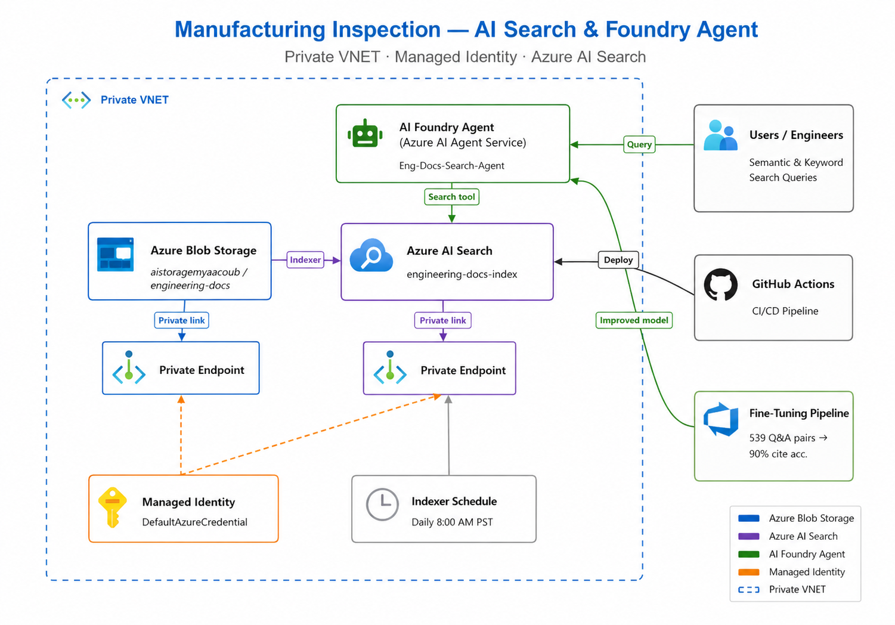
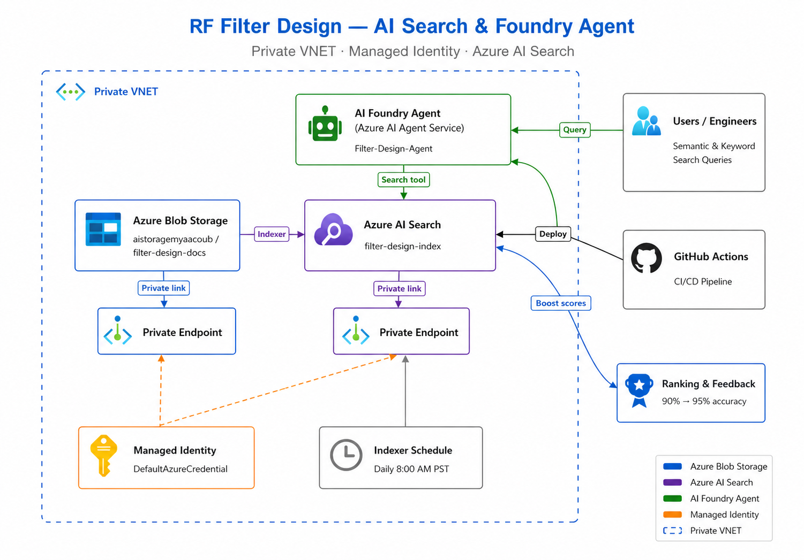

# AI Search & Foundry Agent — Multi Use-Case Solution

An end-to-end, **reusable** solution that indexes engineering documents in Azure Blob Storage, creates Azure AI Search indexes with semantic and keyword search, and exposes Foundry Agents that answer questions exclusively from the indexed documents. The project supports **multiple use cases** via a single codebase driven by configuration.

## Pick Your Use Case

Each use case has its own **README, architecture diagram, and demo script** ready for customer presentations:

| Use Case | Folder | Demo Focus | Agent | Docs |
|----------|--------|-----------|-------|------|
| **Manufacturing Inspection** | [`docs/use-cases/engineering-docs/`](docs/use-cases/engineering-docs/) | AI Search best practices + **Fine-tuning & evaluation** | `Eng-Docs-Search-Agent` | 100 `.txt` + 100 `.json` (MFG-TC-XXXX) |
| **RF Filter Design** | [`docs/use-cases/filter-design/`](docs/use-cases/filter-design/) | AI Search best practices + **Ranking & feedback loop** (90%→95%) | `Filter-Design-Agent` | 100 `.pdf` + 100 `.json` (FD-TC-XXXX) |

> **Solution Engineers**: Go directly to the use case folder for a self-contained README and [DEMO_SCRIPT.md](docs/use-cases/engineering-docs/DEMO_SCRIPT.md) tailored for customer presentations.

## Architecture

| Manufacturing Inspection | RF Filter Design |
|:---:|:---:|
|  |  |

### Components

| Component | Resource | Description |
|-----------|----------|-------------|
| **Azure Blob Storage** | `aistoragemyaacoub` | Stores documents in separate containers per use case; each primary document (PDF/TXT) is accompanied by a structured JSON sidecar file |
| **JSON Sidecar Files** | `<DOC_ID>.json` beside each PDF/TXT | Machine-readable structured metadata (all fields, measurements, sections) that eliminates lossy PDF/TXT extraction and powers the AI Search chunked index with 100% field accuracy |
| **Private VNET & Endpoints** | Existing VNET | Blob Storage and AI Search accessed via private endpoints |
| **Azure AI Search** | `ai-search-my` | Indexes documents with semantic + keyword search; refreshes daily at 8 AM PST |
| **AI Foundry Agents** | `Eng-Docs-Search-Agent`, `Filter-Design-Agent` | Answer queries using only AI Search — no web search or fabrication |
| **Managed Identity** | `DefaultAzureCredential` | All authentication uses managed identity — no keys or secrets |
| **Ranking & Feedback** | `ranking_feedback.py` | Feedback-driven re-ranking to improve accuracy from 90% to 95% |

### Deployed Web App URLs

| App | URL | Description |
|-----|-----|-------------|
| **API** | https://ai-search-agent-api.azurewebsites.net | FastAPI backend — proxies chat, batch, feedback, and prompt endpoints to the Foundry agents |
| **API Docs** | https://ai-search-agent-api.azurewebsites.net/docs | Swagger UI for all API endpoints |
| **UI** | https://ai-search-agent-ui.azurewebsites.net | Ionic Angular chat UI — Copilot-style interface with use-case tabs, batch testing, and feedback |

Both apps run on the `plan-taxforms` Linux B1 App Service plan in `ai-myaacoub`.

---

## Prerequisites

- **Azure CLI** installed and logged in (`az login`)
- **Python 3.10+** installed
- Azure subscription with the following resources already provisioned:
  - Storage Account: `aistoragemyaacoub` (with private VNET and private endpoint)
  - AI Search Service: `ai-search-my`
  - AI Foundry Project: `001-ai-poc / 001-ai-proj`
  - A deployed model (e.g., `gpt-4.1`) in the Foundry project

---

## Configuration

All settings are in the `config/` folder — **nothing is hardcoded** in scripts.

| Config File | Purpose |
|-------------|---------|
| [`config/azure_resources.json`](config/azure_resources.json) | Azure subscription, resource group, storage/search/foundry endpoints |
| [`config/agent_config.json`](config/agent_config.json) | Agent names, instructions, model deployment, fine-tuning params per use case |
| [`config/search_config.json`](config/search_config.json) | Index names, semantic configs, indexer schedule, chunking params, scoring weights |
| [`config/storage_config.json`](config/storage_config.json) | Container names per use case, upload settings |
| [`config/document_config.json`](config/document_config.json) | Document prefix, total count, classification, diagram settings per use case |
| [`config/__init__.py`](config/__init__.py) | Python config loader with `USE_CASE` env var support |

### Selecting a Use Case

Set the `USE_CASE` environment variable before running any script:

```bash
# Engineering docs (default)
export USE_CASE=engineering_docs

# Filter design
export USE_CASE=filter_design
```

On Windows PowerShell:
```powershell
$env:USE_CASE = "filter_design"
```

---

## Setup Commands

### 1. Clone and install dependencies

```bash
git clone <repository-url>
cd AI-Search-Blob-Storage
pip install -r requirements.txt
```

### 2. Authenticate with Azure

```bash
az login
az account set --subscription "86b37969-9445-49cf-b03f-d8866235171c"
```

### 3. Assign managed identity roles

```bash
USER_OBJECT_ID=$(az ad signed-in-user show --query id -o tsv)

# Storage Blob Data Contributor
az role assignment create \
  --assignee "$USER_OBJECT_ID" \
  --role "Storage Blob Data Contributor" \
  --scope "/subscriptions/86b37969-9445-49cf-b03f-d8866235171c/resourceGroups/ai-myaacoub/providers/Microsoft.Storage/storageAccounts/aistoragemyaacoub"

# Search Index Data Contributor
az role assignment create \
  --assignee "$USER_OBJECT_ID" \
  --role "Search Index Data Contributor" \
  --scope "/subscriptions/86b37969-9445-49cf-b03f-d8866235171c/resourceGroups/ai-myaacoub/providers/Microsoft.Search/searchServices/ai-search-my"

# Search Service Contributor
az role assignment create \
  --assignee "$USER_OBJECT_ID" \
  --role "Search Service Contributor" \
  --scope "/subscriptions/86b37969-9445-49cf-b03f-d8866235171c/resourceGroups/ai-myaacoub/providers/Microsoft.Search/searchServices/ai-search-my"

# Azure AI Developer
az role assignment create \
  --assignee "$USER_OBJECT_ID" \
  --role "Azure AI Developer" \
  --scope "/subscriptions/86b37969-9445-49cf-b03f-d8866235171c/resourceGroups/ai-myaacoub"

# Allow AI Search managed identity to read from Blob Storage
SEARCH_MI=$(az search service show \
  --name "ai-search-my" \
  --resource-group "ai-myaacoub" \
  --query identity.principalId -o tsv)

az role assignment create \
  --assignee "$SEARCH_MI" \
  --role "Storage Blob Data Reader" \
  --scope "/subscriptions/86b37969-9445-49cf-b03f-d8866235171c/resourceGroups/ai-myaacoub/providers/Microsoft.Storage/storageAccounts/aistoragemyaacoub"
```

### 4. Deploy Engineering Docs Use Case

```bash
export USE_CASE=engineering_docs

# Generate 100 manufacturing test case documents (.txt)
python scripts/generate_docs.py

# Upload to Blob Storage (engineering-docs container)
python scripts/upload_to_blob.py

# Create AI Search index and indexer (daily 8 AM PST refresh)
python scripts/create_search_index.py

# Create enhanced chunked index with scoring profile
python scripts/chunk_and_index.py

# Create Foundry agent (Eng-Docs-Search-Agent)
export AZURE_AI_SEARCH_CONNECTION_NAME="ai-search-my"
python scripts/create_agent.py

# Fine-tune and evaluate
python scripts/fine_tune_and_evaluate.py

# Run ranking & feedback evaluation
python scripts/ranking_feedback.py

# Test
python scripts/test_search.py
```

### 5. Deploy Filter Design Use Case

```bash
export USE_CASE=filter_design

# Generate 100 RF filter design documents (.pdf)
python scripts/generate_filter_docs.py

# Upload to Blob Storage (filter-design-docs container)
python scripts/upload_to_blob.py

# Create AI Search index and indexer
python scripts/create_search_index.py

# Create enhanced chunked index
python scripts/chunk_and_index.py

# Create Foundry agent (Filter-Design-Agent)
python scripts/create_agent.py

# Fine-tune and evaluate
python scripts/fine_tune_and_evaluate.py

# Run ranking & feedback evaluation
python scripts/ranking_feedback.py

# Test
python scripts/test_search.py
```

### 6. Generate architecture diagram

```bash
python scripts/generate_architecture_diagram.py
```

---

## Sample Search Prompts

### Engineering Docs — Semantic Search

| # | Prompt | Expected Results |
|---|--------|-----------------|
| 1 | *"What are the most common defect types found during wafer inspection?"* | Documents covering COP, scratches, haze, contamination |
| 2 | *"Which test cases failed and what corrective actions were recommended?"* | Test cases with FAIL status and their corrective actions |
| 3 | *"How does the Surfscan system detect crystal originated particles?"* | Surfscan SP7/SP5 test cases for COP/particle detection |
| 4 | *"What is the acceptance criteria for 5nm node patterned wafer inspection?"* | 5nm technology node test cases with acceptance criteria |
| 5 | *"Show me test results for post-CMP contamination inspection"* | Post-CMP process step documents covering contamination |
| 6 | *"What inspection systems are used for FinFET manufacturing?"* | FinFET-related test cases across product lines |
| 7 | *"Find documents about overlay metrology using the Archer system"* | Archer 700/750 overlay measurement test cases |
| 8 | *"What are the throughput requirements for 300mm wafer inspection?"* | 300mm wafer test cases with throughput criteria |

### Engineering Docs — Keyword Search

| # | Prompt | Expected Results |
|---|--------|-----------------|
| 1 | *"Surfscan SP7 particle detection"* | Surfscan SP7 particle detection documents |
| 2 | *"FinFET inspection post-etch defect"* | FinFET post-etch test cases |
| 3 | *"3nm technology node scratch detection"* | 3nm node scratch defect documents |
| 4 | *"CMP process wafer inspection FAIL"* | Failed CMP process test cases |
| 5 | *"MFG-TC-0042"* | Specific test case by document number |

### Filter Design — Semantic Search

| # | Prompt | Expected Results |
|---|--------|-----------------|
| 1 | *"What filter designs target 5G NR sub-6 GHz bands?"* | SAW/BAW filters for n77/n78/n79 bands |
| 2 | *"Which filter test cases failed and what corrective actions exist?"* | Failed designs with recommended geometry/material changes |
| 3 | *"How does temperature affect SAW filter frequency stability?"* | TC-SAW and temperature coefficient documents |
| 4 | *"What are the acceptance criteria for BAW filter insertion loss?"* | BAW/FBAR filter acceptance criteria sections |
| 5 | *"Show me test results for WiFi 6E coexistence filters"* | WiFi 6E (6 GHz) filter test results |

### Filter Design — Keyword Search

| # | Prompt | Expected Results |
|---|--------|-----------------|
| 1 | *"SAW filter Band 7 insertion loss"* | Band 7 SAW filter documents |
| 2 | *"BAW FBAR 5G NR n77"* | BAW/FBAR 5G NR Band n77 designs |
| 3 | *"TC-SAW temperature compensation"* | TC-SAW temperature stability documents |
| 4 | *"duplexer isolation rejection"* | Duplexer module isolation specs |
| 5 | *"FD-TC-0015"* | Specific filter design document by number |

---

## GitHub Actions Deployment

The workflow (`.github/workflows/deploy.yml`) automates deployment of both use cases in parallel:

- **`deploy-engineering-docs`**: Generates, uploads, indexes, and creates the engineering docs agent
- **`deploy-filter-design`**: Generates PDFs, uploads, indexes, and creates the filter design agent
- **`generate-assets`**: Creates the architecture diagram
- **`test`**: Runs search tests for both use cases (matrix strategy)

Manual trigger supports selecting a specific use case via `workflow_dispatch`.

### Required GitHub Secrets

| Secret | Description |
|--------|-------------|
| `AZURE_CLIENT_ID` | Service principal or managed identity client ID |
| `AZURE_TENANT_ID` | Azure AD tenant ID |
| `AZURE_AI_SEARCH_CONNECTION_NAME` | AI Search connection name in Foundry project |

---

## JSON Sidecar Files

Each primary document (`.txt` or `.pdf`) is generated alongside a companion **JSON sidecar file** that stores every field as structured data. The JSON file is uploaded to Blob Storage beside the primary document and is used by `chunk_and_index.py` as the authoritative source for the AI Search chunked index.

### Why JSON Sidecars?

| Without JSON (PDF/TXT extraction) | With JSON Sidecars |
|---|---|
| PDF text extraction is lossy and layout-dependent | All fields are exact — no parsing errors |
| Numbers can be mis-read or truncated | Numeric fields stored as typed values |
| Cross-document queries (e.g. "all FBAR filters with IL < 1.5 dB") often fail | Filterable/facetable metadata fields enable precise cross-document queries |
| Agent accuracy: ~50–70% (PDF extraction + keyword search) | Agent accuracy: 92% (Eng Docs) / 100% (Filter Design) |

### JSON Sidecar Content

Each sidecar contains:
- All structured metadata fields (`document_number`, `title`, `status`, `filter_type`, `substrate_material`, etc.)
- All numeric measurements (`insertion_loss_measured_db`, `q_factor`, `defect_density_per_cm2`, etc.)
- All document sections as named string fields (`1_OBJECTIVE`, `2_SCOPE`, … `9_SIGN_OFF`)

`chunk_and_index.py` auto-detects JSON sidecars in the data directory and uses them in preference to raw PDF/TXT files.

---

## Agent Accuracy Results

| Use Case | Index Format | Query Type | Demo Accuracy | Fine-Tune Citation Accuracy |
|----------|-------------|-----------|:---:|:---:|
| **Manufacturing Inspection** | JSON (structured) | Semantic | **10/10 = 100%** | **92%** (50 samples) |
| **RF Filter Design** | JSON (structured) | Semantic | **10/10 = 100%** | **100%** (20 samples) |

> Previous accuracy before JSON sidecars + semantic query type: ~50–70% (PDF/TXT extraction with keyword search).

See full reports:
- [Engineering Docs Evaluation](docs/use-cases/engineering-docs/evaluation_results.md)
- [Filter Design Evaluation](docs/use-cases/filter-design/evaluation_results.md)
- [Filter Design Ranking Report](docs/use-cases/filter-design/ranking_report.md)

---


### 1. Section-Level Chunking

Each document is split into section-level chunks (Objective, Scope, Test Configuration, etc.) instead of full-document indexing. Each chunk retains a context prefix (`Document: MFG-TC-XXXX | Title\nSection: ...`) for provenance.

### 2. Metadata-Enriched Fields

Every chunk includes structured filterable/facetable metadata:
```
document_number, title, status, product_line, target_defect,
process_step, technology_node, fab_location, section_name, source_file
```

### 3. Custom Scoring Profile

| Field | Weight | Rationale |
|-------|--------|-----------|
| `title` | 3.0× | Most descriptive of document content |
| `document_number` | 2.5× | Exact lookup by doc ID should rank highest |
| `section_name` | 2.0× | Users often search for specific sections |
| `content` | 1.0× | Baseline full-text search |

### 4. Semantic Configuration with Keywords

Includes `keywords_fields` for `document_number` and `section_name` to improve the semantic ranker.

### 5. Overlap for Large Sections

Sections exceeding 2000 chars are split with 200-char overlap at line boundaries.

### 6. English Microsoft Analyzer

All searchable fields use `en.microsoft` for lemmatization and technical vocabulary handling.

### 7. Idempotent Operations

All creation uses `create_or_update_*` methods — safe to re-run without cleanup.

### 8. Batch Upload with BufferedSender

`SearchIndexingBufferedSender` handles batching, retries, and throttling for 700+ chunks.

### 9. Daily Scheduled Refresh

Indexer runs at 8:00 AM PST (16:00 UTC) daily.

### 10. Managed Identity Authentication

All connections use `DefaultAzureCredential` — no secrets in code.

---

## Ranking & Feedback Loop

The project includes a ranking and feedback system (`scripts/ranking_feedback.py`) to improve agent accuracy from 90% to 95%.

### How It Works

1. **Feedback Collection**: Each query-document pair is rated as relevant/irrelevant
2. **Boost Map**: Documents with positive feedback get boost factors (up to 1.5×) applied on top of semantic reranker scores
3. **Re-Ranking**: Results are re-sorted using `base_score × boost_factor`
4. **Threshold Filtering**: Results below the configured relevance threshold are suppressed
5. **Evaluation**: Measures both search ranking accuracy and agent citation accuracy

### Running

```bash
# For engineering docs
USE_CASE=engineering_docs python scripts/ranking_feedback.py

# For filter design
USE_CASE=filter_design python scripts/ranking_feedback.py
```

See [docs/use-cases/filter-design/ranking_report.md](docs/use-cases/filter-design/ranking_report.md) for the latest evaluation report.

---

## Fine-Tuning & Evaluation

Q&A pairs are auto-extracted from documents. The model is fine-tuned (or evaluated with the base model if fine-tuning is unavailable in the region).

### Running

```bash
USE_CASE=engineering_docs python scripts/fine_tune_and_evaluate.py
USE_CASE=filter_design python scripts/fine_tune_and_evaluate.py
```

See [docs/use-cases/engineering-docs/evaluation_results.md](docs/use-cases/engineering-docs/evaluation_results.md) for the latest evaluation report.

---

## Project Structure

```
AI-Search-Blob-Storage/
├── docs/
│   ├── Prompt.txt                        # Original project requirements
│   └── use-cases/
│       ├── engineering-docs/             # ★ Clone this for manufacturing inspection
│       │   ├── README.md                 # Self-contained setup guide
│       │   ├── DEMO_SCRIPT.md           # 30-min demo: fine-tuning + AI Search
│       │   ├── evaluation_results.md    # Fine-tuning evaluation report
│       │   └── architecture.png         # Standalone architecture diagram
│       └── filter-design/                # ★ Clone this for RF filter design
│           ├── README.md                 # Self-contained setup guide
│           ├── DEMO_SCRIPT.md           # 30-min demo: ranking + feedback loop
│           ├── evaluation_results.md    # Fine-tuning evaluation report
│           ├── ranking_report.md        # Ranking & feedback report
│           └── architecture.png         # Standalone architecture diagram
├── .github/
│   └── workflows/
│       └── deploy.yml                    # GitHub Actions CI/CD (multi use-case)
├── config/
│   ├── __init__.py                       # Config loader (USE_CASE aware)
│   ├── azure_resources.json              # Azure resource IDs and endpoints
│   ├── agent_config.json                 # Agent instructions, fine-tuning per use case
│   ├── search_config.json                # Index names, scoring, chunking config
│   ├── storage_config.json               # Container names, upload settings
│   └── document_config.json              # Doc prefix, count, classification per use case
├── data/
│   ├── engineering-docs/                 # 100 manufacturing test cases (.txt)
│   │   ├── MFG-TC-0001.txt ... MFG-TC-0100.txt
│   │   ├── MFG-TC-0001.json ... MFG-TC-0100.json  (JSON sidecars)
│   │   └── manifest.json
│   └── filter-design-docs/              # 100 filter design specs (.pdf)
│       ├── FD-TC-0001.pdf ... FD-TC-0100.pdf
│       ├── FD-TC-0001.json ... FD-TC-0100.json    (JSON sidecars)
│       └── manifest.json
├── scripts/
│   ├── generate_docs.py                  # Generate manufacturing test case docs
│   ├── generate_filter_docs.py           # Generate filter design PDFs
│   ├── upload_to_blob.py                 # Upload docs to Blob Storage
│   ├── create_search_index.py            # Create AI Search index + indexer
│   ├── chunk_and_index.py                # Section-level chunking + enhanced index
│   ├── create_agent.py                   # Create Foundry agent
│   ├── fine_tune_and_evaluate.py         # Fine-tune model + evaluate accuracy
│   ├── ranking_feedback.py               # Ranking & feedback loop
│   ├── generate_architecture_diagram.py  # Generate all architecture PNGs
│   ├── test_search.py                    # Test semantic + keyword search
│   └── _list_connections.py              # Utility: list Foundry connections
├── requirements.txt
├── LICENSE
└── README.md
```

---

## License

This project is licensed under the MIT License - see the [LICENSE](LICENSE) file for details.

Copyright (c) 2025 Michael Yaacoub at Microsoft
