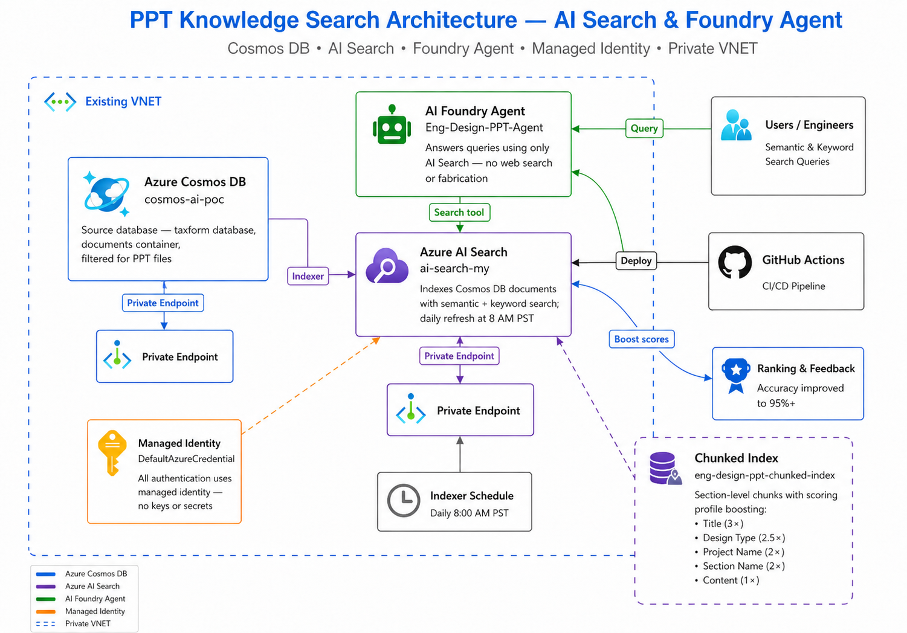

# Use Case: Engineering Design PPT (Cosmos DB)

> **Foundry Agent** that answers questions about engineering design presentations (PPT/PPTX) stored in Azure Cosmos DB, using Azure AI Search as the sole knowledge source.
>
> **Data Source**: Cosmos DB (`cosmos-ai-poc` / `taxform` / `documents`) — filtered for `.ppt` / `.pptx` files
> **Audience**: Engineering teams, design reviewers, project managers

---

## Architecture



### Components

| Component | Resource | Description |
|-----------|----------|-------------|
| **Azure Cosmos DB** | `cosmos-ai-poc` | Source database — `taxform` database, `documents` container, filtered for PPT files |
| **Azure AI Search** | `ai-search-my` | Indexes Cosmos DB documents with semantic + keyword search; daily refresh at 8 AM PST |
| **Chunked Index** | `eng-design-ppt-chunked-index` | Section-level chunks with scoring profile boosting title, design type, project name |
| **AI Foundry Agent** | `Eng-Design-PPT-Agent` | Answers queries using only AI Search — no web search or fabrication |
| **Managed Identity** | `DefaultAzureCredential` | All authentication uses managed identity — no keys or secrets |
| **Private VNET** | Existing VNET | Cosmos DB accessed via private endpoints |

### Deployed Web App URLs

| App | URL | Description |
|-----|-----|-------------|
| **API** | https://ai-search-agent-api.azurewebsites.net | FastAPI backend — proxies chat, batch, feedback, and prompt endpoints |
| **UI** | https://ai-search-agent-ui.azurewebsites.net | Ionic Angular chat UI — Copilot-style interface with use-case tabs |

---

## What This Use Case Demonstrates

1. **Cosmos DB → AI Search Integration** — Indexer connects to Cosmos DB with managed identity, filters PPT documents, and indexes them with daily refresh
2. **Slide-Level Chunking** — Presentations are chunked by slide/section for granular search results
3. **Custom Scoring Profile** — Title (3×), design type (2.5×), project name (2×), section name (2×), content (1×)
4. **Strict Grounding** — Agent only uses AI Search index; never fabricates information
5. **Ranking & Feedback Loop** — Feedback-driven re-ranking to improve accuracy to 95%+

---

## Basic SKU Search Capacity Recommendation

For this use case, start Azure AI Search on **Basic SKU with 2 partitions and 3 replicas**.

| Setting | Recommendation | Why it fits this workload |
|---------|----------------|---------------------------|
| **Partitions** | **2** | Engineering presentation decks usually create more extracted content per source file than the text-based manufacturing corpus, and Cosmos-backed refresh can introduce bigger indexing bursts. Two partitions provide safer headroom for slide-level chunks and future deck growth. |
| **Replicas** | **3** | Presentation search is interactive and review-heavy, so replicas matter more than raw storage. Three replicas support concurrent semantic queries and reduce query latency while scheduled refresh is running. |

### Benefits of partitions and replicas

- **Partitions** expand storage and indexing throughput, which is useful when slide decks accumulate more chunks or embedded speaker-note content over time.
- **Replicas** increase query throughput and help maintain availability for engineering review scenarios where many users ask broad semantic questions against the same corpus.
- **2 partitions + 3 replicas** gives this PPT workload more room for growth on Basic without forcing an early SKU change.

If content remains limited to a small pilot corpus, monitor index size and indexer duration before deciding whether to step back to one partition. Keep three replicas if the agent is exposed to shared demo or review traffic.

---

## Quick Start

### Prerequisites

- **Azure CLI** installed and logged in (`az login`)
- **Python 3.10+** with `pip install -r requirements.txt`
- Azure Cosmos DB with `taxform` database and `documents` container containing PPT presentation data
- Managed identity with **Cosmos DB Built-in Data Contributor** role (`00000000-0000-0000-0000-000000000002`) on the Cosmos DB account — required for both the **App Service** and **AI Search** managed identities
- AI Search service managed identity also needs the same **Cosmos DB Built-in Data Contributor** role
- API App Service managed identity also needs **Storage Blob Data Reader** on storage account `aistoragemyaacoub` so original PPT/PPTX files can be streamed from Blob Storage
- If the storage account uses a private endpoint with `publicNetworkAccess` disabled, the API App Service must be integrated with the same VNet and an App Service delegated subnet so it can resolve and reach `privatelink.blob.core.windows.net`

### Setup Commands

```bash
# 1a. Assign Cosmos DB Data Contributor to AI Search managed identity
az cosmosdb sql role assignment create \
  --account-name cosmos-ai-poc \
  --resource-group ai-myaacoub \
  --role-definition-id "00000000-0000-0000-0000-000000000002" \
  --scope "/" \
  --principal-id <AI_SEARCH_MANAGED_IDENTITY_OBJECT_ID>

# 1b. Assign Cosmos DB Data Contributor to App Service managed identity
az cosmosdb sql role assignment create \
  --account-name cosmos-ai-poc \
  --resource-group ai-myaacoub \
  --role-definition-id "00000000-0000-0000-0000-000000000002" \
  --scope "/" \
  --principal-id <APP_SERVICE_MANAGED_IDENTITY_OBJECT_ID>

# 2. Set the use case
export USE_CASE=eng_design_ppt          # Linux/Mac
$env:USE_CASE = "eng_design_ppt"        # PowerShell

# 3. Create AI Search index with Cosmos DB data source and indexer
python scripts/create_cosmosdb_search_index.py

# 4. Create enhanced chunked index with scoring profile
python scripts/chunk_and_index_cosmosdb.py

# 5. Create Foundry agent (Eng-Design-PPT-Agent)
export AZURE_AI_SEARCH_CONNECTION_NAME="ai-search-my"
python scripts/create_agent.py

# 6. Run ranking & feedback evaluation
python scripts/ranking_feedback.py
```

### Managed Identity Setup

> **Important**: Both the AI Search service and the API App Service need **Cosmos DB Built-in Data Contributor** (`00000000-0000-0000-0000-000000000002`) role. The Data Reader role (`...0001`) is insufficient — the API requires `readMetadata` which is only in the Data Contributor role.

```bash
# Get the AI Search service principal ID
SEARCH_PRINCIPAL_ID=$(az search service show \
  --name ai-search-my \
  --resource-group ai-myaacoub \
  --query identity.principalId -o tsv)

# Assign Cosmos DB Built-in Data Contributor to AI Search
az cosmosdb sql role assignment create \
  --account-name cosmos-ai-poc \
  --resource-group ai-myaacoub \
  --role-definition-id 00000000-0000-0000-0000-000000000002 \
  --scope "/" \
  --principal-id $SEARCH_PRINCIPAL_ID

# Get the App Service managed identity principal ID
APP_PRINCIPAL_ID=$(az webapp identity show \
  --name ai-search-agent-api \
  --resource-group ai-myaacoub \
  --query principalId -o tsv)

# Assign Cosmos DB Built-in Data Contributor to App Service
az cosmosdb sql role assignment create \
  --account-name cosmos-ai-poc \
  --resource-group ai-myaacoub \
  --role-definition-id 00000000-0000-0000-0000-000000000002 \
  --scope "/" \
  --principal-id $APP_PRINCIPAL_ID

# Assign Storage Blob Data Reader to App Service
az role assignment create \
  --assignee-object-id $APP_PRINCIPAL_ID \
  --assignee-principal-type ServicePrincipal \
  --role "Storage Blob Data Reader" \
  --scope "/subscriptions/86b37969-9445-49cf-b03f-d8866235171c/resourceGroups/ai-myaacoub/providers/Microsoft.Storage/storageAccounts/aistoragemyaacoub"

# If Blob Storage is private-endpoint only, integrate the API App Service with the app subnet
az webapp vnet-integration add \
  --name ai-search-agent-api \
  --resource-group ai-myaacoub \
  --vnet vnet-salespoc-westus2 \
  --subnet snet-appservice

az webapp config appsettings set \
  --name ai-search-agent-api \
  --resource-group ai-myaacoub \
  --settings WEBSITE_VNET_ROUTE_ALL=1
```

---

## Demo Script

### Act 1: The Problem (2 min)

**Talking Points:**
- Engineering review decks contain architecture decisions, specifications, milestone updates, and risk discussions spread across many slides.
- Teams waste time opening multiple presentations just to find one design trade-off or reliability result.
- Traditional search is weak when slide text is fragmented and the user asks broader semantic questions.
- Goal: demonstrate a grounded Foundry agent that answers design-review questions using only indexed presentation content.

### Act 2: Cosmos DB Source and Access Model (4 min)

**2.1 — Explain the source system**

Highlight these points from the architecture section:
- The source documents live in Cosmos DB under `taxforms/documents`.
- This use case filters only `.ppt` and `.pptx` files.
- Cosmos DB is reachable through a private endpoint, so indexing and refresh must run from an allowed network path.

> **Key Point**: This is a realistic enterprise pattern where the knowledge base already exists in an operational store rather than a demo upload folder.

**2.2 — Create the baseline index**

```bash
export USE_CASE=eng_design_ppt         # Linux/Mac
$env:USE_CASE = "eng_design_ppt"      # PowerShell
python scripts/create_cosmosdb_search_index.py
```

> **Key Point**: The indexer uses managed identity and Cosmos DB filtering to isolate only presentation content for this agent.

### Act 3: Slide-Level Chunking and Search Quality (8 min)

**3.1 — Build the chunked index**

```bash
python scripts/chunk_and_index_cosmosdb.py
```

Explain what the chunked representation gives you:
- Slide or section-level retrieval instead of entire presentations
- Document-aware citations using the original file name
- Metadata signals that help rank project-specific and category-specific content

**3.2 — Explain why chunking matters**

- A single presentation can mix requirements, trade-off analysis, risk registers, and test results.
- Chunking makes it easier for the agent to return the correct section instead of summarizing an unrelated slide.
- This is especially important for prompts about thermal constraints, material selection, and milestones.

**3.3 — Compare direct search modes**

```bash
python scripts/test_search.py
```

Use the results to describe:
- **Keyword search** works well for exact design terms.
- **Semantic search** is stronger for broader review questions such as architecture decisions or trade-off analysis.

### Act 4: Foundry Agent in Action (6 min)

**4.1 — Create the agent**

```bash
python scripts/create_agent.py
```

Call out the operating model:
- The agent uses Azure AI Search as its only tool.
- It is configured to answer from retrieved chunks only.
- Every grounded response is expected to include citations to the underlying presentation files.

**4.2 — Use a live prompt set**

Suggested live prompts:
- "What key design specifications are listed in filter_design_active_rc_lp_05.pptx?"
- "Which slides in filter_design_active_rc_lp_05.pptx cover system architecture decisions?"
- "What trade-off analyses were performed in filter_design_butterworth_lp_01.pptx for material selection?"
- "What reliability testing results are documented in filter_design_butterworth_lp_10.pptx?"

> **Key Point**: The audience should see that the agent is not inventing architecture recommendations; it is retrieving them from actual design decks.

### Act 5: Accuracy and Closeout (5 min)

**5.1 — Run the grounded demo check**

```bash
python scripts/retest_demo_accuracy.py
```

Call out the current result from the latest rerun:
- **Grounded agent accuracy: 100.0% (10/10 prompts)**

**5.2 — Business takeaway**

- Engineers can query design-review material conversationally without losing traceability.
- Slide-level grounding improves trust for program reviews and decision audits.
- The same pattern can be reused for other presentation-heavy knowledge bases in Cosmos DB.

---

## AI Search Best Practices

| Practice | Implementation |
|----------|---------------|
| **Cosmos DB Data Source** | Managed identity connection with SQL API query filtering for `.ppt` / `.pptx` files |
| **Slide-Level Chunking** | Each slide/section becomes a separate search chunk for precise retrieval |
| **Custom Scoring Profile** | Title (3×), design type (2.5×), project name (2×) boost relevant metadata |
| **Semantic Configuration** | Content as primary field, title as title field, design type and project name as keywords |
| **Daily Refresh** | Indexer runs daily at 8 AM PST to pick up new/updated documents |
| **Overlap Context** | 200-character overlap between chunks preserves context at boundaries |

---

## Sample Prompts

### Semantic Search
- "What key design specifications are listed in filter_design_active_rc_lp_05.pptx?"
- "Which slides in filter_design_active_rc_lp_05.pptx discuss system architecture decisions?"
- "What material trade-off analysis appears in filter_design_butterworth_lp_01.pptx?"
- "How are thermal constraints addressed in filter_design_active_rc_lp_01.pptx?"
- "What project milestones are documented in filter_design_chebyshev2_lp_05.pptx?"

### Keyword Search
- "filter_design_active_rc_lp_05.pptx design specifications"
- "filter_design_active_rc_lp_05.pptx system architecture"
- "filter_design_butterworth_lp_01.pptx material trade-off"
- "filter_design_active_rc_lp_01.pptx thermal constraints"
- "filter_design_butterworth_lp_10.pptx reliability results"

### Agent Queries
- "What key design specifications are listed in filter_design_active_rc_lp_05.pptx?"
- "Which slides in filter_design_active_rc_lp_05.pptx cover system architecture decisions?"
- "List the critical risks identified in filter_design_chebyshev2_lp_05.pptx."
- "What trade-off analyses were performed in filter_design_butterworth_lp_01.pptx for material selection?"
- "What project milestones are documented in filter_design_chebyshev2_lp_05.pptx?"

---

## Ranking & Feedback Loop

The ranking and feedback system improves accuracy from baseline 90% to 95%+:

1. **Feedback Collection**: User feedback (relevant/irrelevant) per query-document pair
2. **Re-Ranking**: Documents with positive feedback get boost factors (up to 1.5×)
3. **Relevance Threshold**: Results below 0.7 relevance score are suppressed
4. **Evaluation**: Periodic accuracy evaluation against curated query sets

Run the feedback evaluation:
```bash
$env:USE_CASE = "eng_design_ppt"
python scripts/ranking_feedback.py
```

Results are saved to `docs/use-cases/eng-design-ppt/ranking_report.md`.

---

## Configuration Files

| File | Purpose |
|------|---------|
| [config/azure_resources.json](../../config/azure_resources.json) | Cosmos DB account, AI Search, Foundry endpoint |
| [config/search_config.json](../../config/search_config.json) | Index names, semantic configs, indexer settings, Cosmos DB query filter |
| [config/agent_config.json](../../config/agent_config.json) | Agent name, model, instructions, fine-tuning settings |
| [config/document_config.json](../../config/document_config.json) | Document prefix, file format, Cosmos DB filter type |
| [config/prompts_config.json](../../config/prompts_config.json) | Sample prompts for testing (keyword, semantic, agent) |
