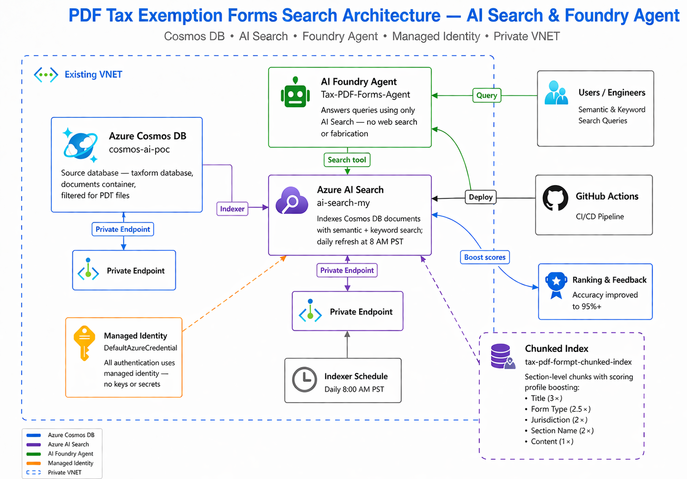

# Use Case: Tax Exemption PDF Forms (Cosmos DB)

> **Foundry Agent** that answers questions about tax exemption PDF forms stored in Azure Cosmos DB, using Azure AI Search as the sole knowledge source.
>
> **Data Source**: Cosmos DB (`cosmos-ai-poc` / `taxform` / `documents`) — filtered for `.pdf` files
> **Audience**: Tax compliance teams, finance departments, audit reviewers

---

## Architecture



### Components

| Component | Resource | Description |
|-----------|----------|-------------|
| **Azure Cosmos DB** | `cosmos-ai-poc` | Source database — `taxform` database, `documents` container, filtered for PDF files |
| **Azure AI Search** | `ai-search-my` | Indexes Cosmos DB documents with semantic + keyword search; daily refresh at 8 AM PST |
| **Chunked Index** | `tax-pdf-forms-chunked-index` | Section-level chunks with scoring profile boosting title, form type, jurisdiction |
| **AI Foundry Agent** | `Tax-PDF-Forms-Agent` | Answers queries using only AI Search — no web search or fabrication |
| **Managed Identity** | `DefaultAzureCredential` | All authentication uses managed identity — no keys or secrets |
| **Private VNET** | Existing VNET | Cosmos DB accessed via private endpoints |

### Deployed Web App URLs

| App | URL | Description |
|-----|-----|-------------|
| **API** | https://ai-search-agent-api.azurewebsites.net | FastAPI backend — proxies chat, batch, feedback, and prompt endpoints |
| **UI** | https://ai-search-agent-ui.azurewebsites.net | Ionic Angular chat UI — Copilot-style interface with use-case tabs |

---

## What This Use Case Demonstrates

1. **Cosmos DB → AI Search Integration** — Indexer connects to Cosmos DB with managed identity, filters PDF documents, and indexes them with daily refresh
2. **Section-Level Chunking** — Documents are chunked by section for granular search results
3. **Custom Scoring Profile** — Title (3×), form type (2.5×), jurisdiction (2×), section name (2×), content (1×)
4. **Strict Grounding** — Agent only uses AI Search index; never fabricates information
5. **Ranking & Feedback Loop** — Feedback-driven re-ranking to improve accuracy to 95%+

---

## Basic SKU Search Capacity Recommendation

For this use case, start Azure AI Search on **Basic SKU with 2 partitions and 3 replicas**.

| Setting | Recommendation | Why it fits this workload |
|---------|----------------|---------------------------|
| **Partitions** | **2** | Cosmos DB sourced PDF forms can grow faster, and the chunked index carries more jurisdictional and form-type metadata than the blob-based demos. Two partitions provide more indexing throughput and storage headroom for ongoing document expansion and daily refresh jobs. |
| **Replicas** | **3** | Three replicas preserve query responsiveness for compliance users while scheduled indexing runs against live data. Replicas are the main lever for query concurrency and availability on Basic. |

### Benefits of partitions and replicas

- **Partitions** help absorb larger chunk counts, faster Cosmos-driven refresh cycles, and future growth across many state and form variants.
- **Replicas** keep interactive agent queries responsive, especially when multiple users ask jurisdiction-specific questions during ingestion windows.
- **2 partitions + 3 replicas** is the better Basic-tier balance here because this workload is more dynamic than the static blob demos and benefits from extra indexing capacity without overcomplicating the service topology.

If Cosmos growth remains small, this can be tuned back to one partition after observing storage and indexer duration metrics. Replicas should remain at three unless the workload is strictly non-production and single-user.

---

## Quick Start

### Prerequisites

- **Azure CLI** installed and logged in (`az login`)
- **Python 3.10+** with `pip install -r requirements.txt`
- Azure Cosmos DB with `taxform` database and `documents` container containing PDF form data
- Managed identity with **Cosmos DB Built-in Data Contributor** role (`00000000-0000-0000-0000-000000000002`) on the Cosmos DB account — required for both the **App Service** and **AI Search** managed identities
- AI Search service managed identity also needs the same **Cosmos DB Built-in Data Contributor** role
- API App Service managed identity also needs **Storage Blob Data Reader** on storage account `aistoragemyaacoub` so document originals can be streamed from Blob Storage
- If the storage account uses a private endpoint with `publicNetworkAccess` disabled, the API App Service must be integrated with the same VNet and an App Service delegated subnet so it can resolve and reach `privatelink.blob.core.windows.net`

### Setup Commands

```bash
# 1a. Assign Cosmos DB Data Contributor to AI Search managed identity
az cosmosdb sql role assignment create \
  --account-name cosmos-ai-poc \
  --resource-group ai-myaacoub \
  --role-definition-id "00000000-0000-0000-0000-000000000002" \
  --scope "/" \
  --principal-id <AI_SEARCH_MANAGED_IDENTITY_OBJECT_ID>

# 1b. Assign Cosmos DB Data Contributor to App Service managed identity
az cosmosdb sql role assignment create \
  --account-name cosmos-ai-poc \
  --resource-group ai-myaacoub \
  --role-definition-id "00000000-0000-0000-0000-000000000002" \
  --scope "/" \
  --principal-id <APP_SERVICE_MANAGED_IDENTITY_OBJECT_ID>

# 2. Set the use case
export USE_CASE=tax_pdf_forms          # Linux/Mac
$env:USE_CASE = "tax_pdf_forms"        # PowerShell

# 3. Create AI Search index with Cosmos DB data source and indexer
python scripts/create_cosmosdb_search_index.py

# 4. Create enhanced chunked index with scoring profile
python scripts/chunk_and_index_cosmosdb.py

# 5. Create Foundry agent (Tax-PDF-Forms-Agent)
export AZURE_AI_SEARCH_CONNECTION_NAME="ai-search-my"
python scripts/create_agent.py

# 6. Run ranking & feedback evaluation
python scripts/ranking_feedback.py
```

### Managed Identity Setup

> **Important**: Both the AI Search service and the API App Service need **Cosmos DB Built-in Data Contributor** (`00000000-0000-0000-0000-000000000002`) role. The Data Reader role (`...0001`) is insufficient — the API requires `readMetadata` which is only in the Data Contributor role.

```bash
# Get the AI Search service principal ID
SEARCH_PRINCIPAL_ID=$(az search service show \
  --name ai-search-my \
  --resource-group ai-myaacoub \
  --query identity.principalId -o tsv)

# Assign Cosmos DB Built-in Data Contributor to AI Search
az cosmosdb sql role assignment create \
  --account-name cosmos-ai-poc \
  --resource-group ai-myaacoub \
  --role-definition-id 00000000-0000-0000-0000-000000000002 \
  --scope "/" \
  --principal-id $SEARCH_PRINCIPAL_ID

# Get the App Service managed identity principal ID
APP_PRINCIPAL_ID=$(az webapp identity show \
  --name ai-search-agent-api \
  --resource-group ai-myaacoub \
  --query principalId -o tsv)

# Assign Cosmos DB Built-in Data Contributor to App Service
az cosmosdb sql role assignment create \
  --account-name cosmos-ai-poc \
  --resource-group ai-myaacoub \
  --role-definition-id 00000000-0000-0000-0000-000000000002 \
  --scope "/" \
  --principal-id $APP_PRINCIPAL_ID

# Assign Storage Blob Data Reader to App Service
az role assignment create \
  --assignee-object-id $APP_PRINCIPAL_ID \
  --assignee-principal-type ServicePrincipal \
  --role "Storage Blob Data Reader" \
  --scope "/subscriptions/86b37969-9445-49cf-b03f-d8866235171c/resourceGroups/ai-myaacoub/providers/Microsoft.Storage/storageAccounts/aistoragemyaacoub"

# If Blob Storage is private-endpoint only, integrate the API App Service with the app subnet
az webapp vnet-integration add \
  --name ai-search-agent-api \
  --resource-group ai-myaacoub \
  --vnet vnet-salespoc-westus2 \
  --subnet snet-appservice

az webapp config appsettings set \
  --name ai-search-agent-api \
  --resource-group ai-myaacoub \
  --settings WEBSITE_VNET_ROUTE_ALL=1
```

---

## Demo Script

### Act 1: The Problem (2 min)

**Talking Points:**
- Tax teams work across many state-specific exemption certificates, resale forms, and nonprofit filings.
- Users usually need exact form names, dates, eligibility rules, and jurisdiction coverage, not generic tax guidance.
- Traditional file search does a poor job when the same concepts appear under different state labels and certificate formats.
- Goal: show a grounded Foundry agent that answers only from indexed tax-form documents with citations.

### Act 2: Cosmos DB Data Flow and Security (4 min)

**2.1 — Explain the source system**

Walk through the architecture table and highlight:
- The source documents are already stored in Cosmos DB under `taxforms/documents`.
- Only `.pdf` records are selected for this use case.
- Cosmos DB is protected by a private endpoint, so indexing and chunk refresh must run from an approved network path.

> **Key Point**: This demo uses existing operational documents in Cosmos DB instead of staged local files, which makes the retrieval flow closer to a production line-of-business scenario.

**2.2 — Show the index creation step**

```bash
export USE_CASE=tax_pdf_forms          # Linux/Mac
$env:USE_CASE = "tax_pdf_forms"       # PowerShell
python scripts/create_cosmosdb_search_index.py
```

> **Key Point**: Run this from a VNet-integrated environment. The AI Search service and the runner both need Cosmos DB access that honors the private endpoint and managed-identity authorization model.

### Act 3: Chunked Index and Retrieval Quality (8 min)

**3.1 — Build the chunked index**

```bash
python scripts/chunk_and_index_cosmosdb.py
```

Explain what the chunker preserves for each document:
- `Document: <fileName>` for exact citation output
- State and jurisdiction metadata for relevance boosting
- Section-level content so deadline, eligibility, and approval answers come back from the right section

**3.2 — Explain why chunking matters**

- A full tax form often mixes company details, exemption rules, certificate fields, and signature blocks.
- Chunking prevents the agent from receiving an entire form when the user only asked for a deadline, required form, or renewal date.
- Metadata-aware chunking also improves state-specific prompts such as Texas or California questions.

**3.3 — Show the direct search behavior**

```bash
python scripts/test_search.py
```

Use the results to explain:
- **Keyword search** is effective for exact form names and certificate terminology.
- **Semantic search** is better for natural-language questions like renewal workflows or filing requirements.

### Act 4: Foundry Agent Grounding (6 min)

**4.1 — Create the agent**

```bash
python scripts/create_agent.py
```

Highlight the guardrails:
- The agent uses Azure AI Search as its only tool.
- It is instructed to avoid fabrication and return cited answers only.
- For ambiguous tax questions, it prefers cited partial answers from retrieved forms instead of unsupported generalizations.

**4.2 — Run example prompts**

Use these prompts live:
- "What renewal steps are described in lq_tax_exemption_IN_001_yellow.pdf?"
- "How does lq_tax_exemption_ME_001_blue.pdf describe nonprofit tax exemption filing?"
- "What property tax exemption deadline is listed in lq_tax_exemption_AL_002_green.pdf?"
- "What documentation does lq_tax_exemption_WV_002_red.pdf require for a resale certificate?"

> **Key Point**: The expected behavior is grounded retrieval with document citations, not generic tax advice.

### Act 5: Accuracy and Readout (5 min)

**5.1 — Run the demo accuracy check**

```bash
python scripts/retest_demo_accuracy.py
```

Call out the current result from the latest rerun:
- **Grounded agent accuracy: 100.0% (10/10 prompts)**

**5.2 — Close with the business value**

- Compliance teams get faster answers with source traceability.
- State-specific retrieval improves trust because the agent cites the exact form it used.
- The same pattern can be extended to other regulated document sets stored in Cosmos DB.

---

## AI Search Best Practices

| Practice | Implementation |
|----------|---------------|
| **Cosmos DB Data Source** | Managed identity connection with SQL API query filtering for `.pdf` files |
| **Section-Level Chunking** | Each document section becomes a separate search chunk for precise retrieval |
| **Custom Scoring Profile** | Title (3×), form type (2.5×), jurisdiction (2×) boost relevant metadata |
| **Semantic Configuration** | Content as primary field, title as title field, form type and jurisdiction as keywords |
| **Daily Refresh** | Indexer runs daily at 8 AM PST to pick up new/updated documents |
| **Overlap Context** | 200-character overlap between chunks preserves context at boundaries |

---

## Sample Prompts

### Semantic Search
- "What renewal process is described in lq_tax_exemption_IN_001_yellow.pdf?"
- "How does lq_tax_exemption_ME_001_blue.pdf describe filing for a nonprofit tax exemption certificate?"
- "What deadline is listed in lq_tax_exemption_AL_002_green.pdf for property tax exemption?"
- "What multi-jurisdiction exemption details are described in lq_tax_exemption_MA_001_blue.pdf?"
- "What documentation is required in lq_tax_exemption_WV_002_red.pdf for a resale certificate?"

### Keyword Search
- "lq_tax_exemption_IN_001_yellow.pdf renewal"
- "lq_tax_exemption_ME_001_blue.pdf nonprofit certificate"
- "lq_tax_exemption_AL_002_green.pdf property tax deadline"
- "lq_tax_exemption_WV_002_red.pdf resale certificate documentation"
- "lq_tax_exemption_CA_001_blue.pdf 501(c)(3) eligibility"

### Agent Queries
- "What renewal steps are described in lq_tax_exemption_IN_001_yellow.pdf?"
- "What property tax exemption deadline is listed in lq_tax_exemption_AL_002_green.pdf?"
- "What agricultural exemption requirements are described in lq_tax_exemption_AR_002_red.pdf?"
- "Which sections of lq_tax_exemption_MI_001_yellow.pdf mention notarization?"
- "What 501(c)(3) eligibility language appears in lq_tax_exemption_CA_001_blue.pdf?"

---

## Ranking & Feedback Loop

The ranking and feedback system improves accuracy from baseline 90% to 95%+:

1. **Feedback Collection**: User feedback (relevant/irrelevant) per query-document pair
2. **Re-Ranking**: Documents with positive feedback get boost factors (up to 1.5×)
3. **Relevance Threshold**: Results below 0.7 relevance score are suppressed
4. **Evaluation**: Periodic accuracy evaluation against curated query sets

Run the feedback evaluation:
```bash
$env:USE_CASE = "tax_pdf_forms"
python scripts/ranking_feedback.py
```

Results are saved to `docs/use-cases/tax-pdf-forms/ranking_report.md`.

---

## Configuration Files

| File | Purpose |
|------|---------|
| [config/azure_resources.json](../../config/azure_resources.json) | Cosmos DB account, AI Search, Foundry endpoint |
| [config/search_config.json](../../config/search_config.json) | Index names, semantic configs, indexer settings, Cosmos DB query filter |
| [config/agent_config.json](../../config/agent_config.json) | Agent name, model, instructions, fine-tuning settings |
| [config/document_config.json](../../config/document_config.json) | Document prefix, file format, Cosmos DB filter type |
| [config/prompts_config.json](../../config/prompts_config.json) | Sample prompts for testing (keyword, semantic, agent) |
