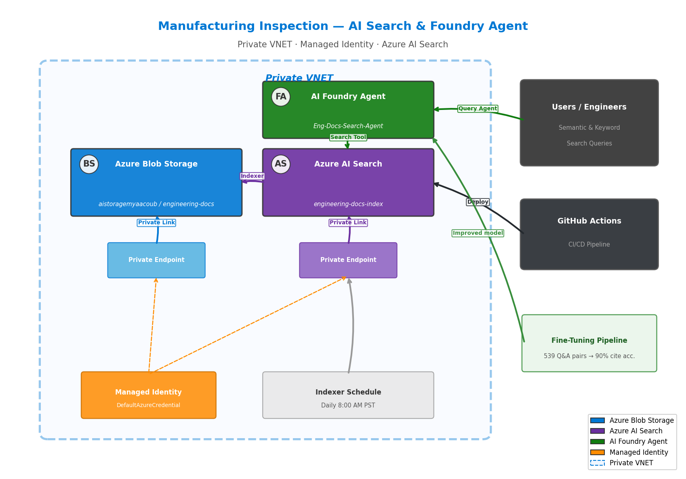

# Use Case: Manufacturing Inspection — Engineering Documents

> **Clone this folder** if you want to build a Foundry Agent that answers questions about semiconductor manufacturing inspection test cases using Azure AI Search.



## What This Use Case Does

- Generates **100 synthetic manufacturing test case documents** (.txt) covering semiconductor inspection, metrology, defect detection, and quality assurance
- Uploads them to a dedicated **Azure Blob Storage container** (`engineering-docs`)
- Creates an **Azure AI Search index** with semantic + keyword search, refreshed daily at 8 AM PST
- Deploys a **Foundry Agent** (`Eng-Docs-Search-Agent`) that answers questions exclusively from the indexed documents
- **Fine-tunes** a model on extracted Q&A pairs and evaluates citation accuracy
- Produces evaluation reports with metrics

## Demo Focus: Fine-Tuning & AI Search Best Practices

This use case demonstrates:

1. **AI Search Best Practices** — section-level chunking, metadata facets, custom scoring profiles, semantic configuration
2. **Model Fine-Tuning** — auto-extracting Q&A pairs from documents, JSONL training data, fine-tuning with Azure AI Foundry, evaluation with citation accuracy metrics

See [DEMO_SCRIPT.md](DEMO_SCRIPT.md) for a step-by-step walkthrough.

## Quick Start

```bash
# Set the use case
export USE_CASE=engineering_docs   # Linux/Mac
$env:USE_CASE = "engineering_docs" # PowerShell

# Generate 100 test case documents
python scripts/generate_docs.py

# Upload to Blob Storage
python scripts/upload_to_blob.py

# Create standard search index + indexer
python scripts/create_search_index.py

# Create chunked index with best practices
python scripts/chunk_and_index.py

# Create Foundry agent
export AZURE_AI_SEARCH_CONNECTION_NAME="ai-search-my"
python scripts/create_agent.py

# Fine-tune and evaluate
python scripts/fine_tune_and_evaluate.py

# Test
python scripts/test_search.py
```

## Key Scripts

| Script | Purpose |
|--------|---------|
| `scripts/generate_docs.py` | Generate 100 manufacturing test case `.txt` files |
| `scripts/upload_to_blob.py` | Upload to `engineering-docs` container |
| `scripts/create_search_index.py` | Create standard AI Search index + indexer |
| `scripts/chunk_and_index.py` | Section-level chunking with scoring profile |
| `scripts/create_agent.py` | Create `Eng-Docs-Search-Agent` in Foundry |
| `scripts/fine_tune_and_evaluate.py` | Fine-tune model + evaluate citation accuracy |
| `scripts/test_search.py` | Run semantic + keyword search tests |

## Sample Prompts

### Semantic Search
- *"What are the most common defect types found during wafer inspection?"*
- *"Which test cases failed and what corrective actions were recommended?"*
- *"What is the acceptance criteria for 5nm node patterned wafer inspection?"*

### Keyword Search
- *"Surfscan SP7 particle detection"*
- *"3nm technology node scratch detection"*
- *"MFG-TC-0042"*

## Output Files

| File | Description |
|------|-------------|
| `data/engineering-docs/MFG-TC-*.txt` | 100 generated test case documents |
| `data/engineering-docs/manifest.json` | Document index |
| `data/engineering-docs/fine_tuning_train.jsonl` | Training data (~539 Q&A pairs) |
| `data/engineering-docs/fine_tuning_validation.jsonl` | Validation data (~135 Q&A pairs) |
| `data/engineering-docs/evaluation_metrics.json` | Raw evaluation metrics |
| `docs/evaluation_results.md` | Human-readable evaluation report |
